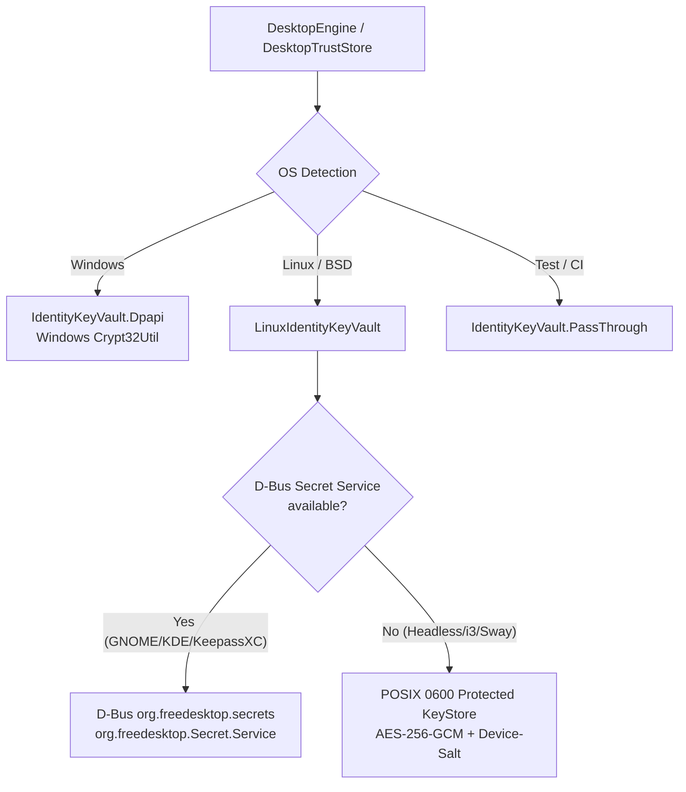
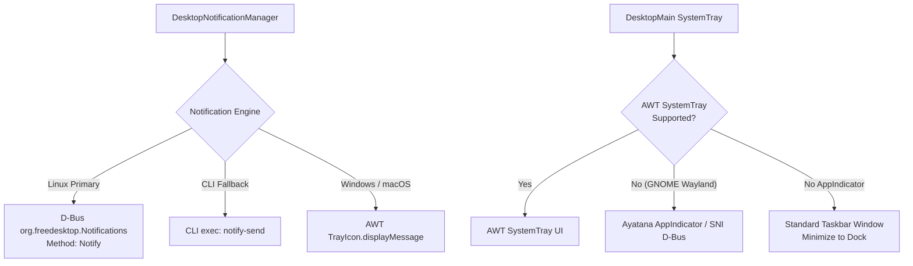
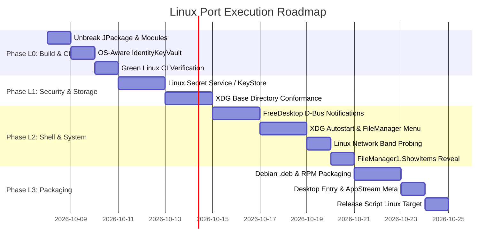

# Flash Linux Port — Architectural Review, Gap Analysis & Execution Plan

**Author:** Flash Team  
**Date:** 2026-10-07  
**Status:** PROPOSED & READY FOR DISCUSSION  
**Target Platform:** Linux Desktop (Debian / Ubuntu, Fedora / RHEL, Arch / Flatpak / AppImage, Wayland & X11)  
**Parent Blueprint:** [android-lan-wifi-direct-transfer-app-plan.md](file:///C:/Users/KaliOxygen/Downloads/Flash/Project%20Goal%20and%20Blueprint/android-lan-wifi-direct-transfer-app-plan.md)  
**Related Plans:** [ADAPTIVE-UI-PLAN.md](file:///C:/Users/KaliOxygen/Downloads/Flash/docs/migration/ADAPTIVE-UI-PLAN.md), [PHASE-26-desktop-identity-p2.md](file:///C:/Users/KaliOxygen/Downloads/Flash/docs/migration/PHASE-26-desktop-identity-p2.md), [release-build.md](file:///C:/Users/KaliOxygen/Downloads/Flash/docs/release-build.md)

---

## 0. Review corrections (2026-10-07, fact-checked against the code and docs)

This plan was reviewed against the repository the day it was written. Corrections are applied inline and listed here so
nothing is silently changed. Read these before the rest.

| # | Claim in the first draft | Finding | Verified how |
|---|---|---|---|
| C1 | Proposes ADR-089, ADR-090, ADR-091 | **Numbers already taken** (swarm ADRs). Highest existing ADR is ADR-091. Renamed below to **ADR-092..094 (PROPOSED)**; re-check the next free number when accepting. | `docs/decisions.md` headings |
| C2 | "Add `.deb` and `.rpm` tasks" | `TargetFormat.Deb` is **already** in `targetFormats` (`desktop/build.gradle.kts:166`). Only RPM is missing. | file read |
| C3 | Gap #1 presented as new | It is audit item `TASK-CORE-SEC-1` (`docs/audit/2026-09-28-architectural-audit-and-tasks.md`). The Linux **CI** part was fixed test-side on 2026-09-30 (`DesktopEngine.identityVault` parameter, default still `Dpapi`); the **product** gap is open. | progress.md 2026-09-30 |
| C4 | "App crashes on startup" on Linux | **Confirmed for first run.** `PersistedFlashCrypto.loadOrGenerate` calls `persist()` -> `vault.protect()` outside any `runCatching`, so `Crypt32Util` throws. An *existing* blob that cannot be read degrades loudly to an in-memory identity instead (so two different failure modes). | `PersistedFlashCrypto.kt:85-152` |
| C5 | Desktop target assumed to include Linux | `docs/audit/FIX-PHASES.md:101` records "The desktop target is Windows-only". ADR-058 and the owner's iOS/Linux goal moved this, but **no ADR says "Linux desktop is a committed target"**. See decision D-L1 below. | docs read |
| C6 | "D-Bus / JNA" for Secret Service, Notifications, FileManager1 | **JNA does not speak D-Bus.** A D-Bus client library is required (for example `dbus-java`) and AGENTS.md section 3 requires documenting it (version, licence, alternatives). The same library should serve BlueZ if `docs/network/BLUETOOTH-AND-RADIO-TNC-PLAN.md` is ever built. | design review |
| C7 | Fallback key = AES-GCM from `/etc/machine-id` + salt, called "protected" | `/etc/machine-id` is world-readable, so this is **obfuscation, not protection** against any process of the same user or a disk copy. It must be documented as a weaker tier than DPAPI (ADR-035 is explicit about DPAPI's own limit). A passphrase-derived key (Argon2id, user-entered) is the only real protection without a keyring. | design review |
| C8 | Hash "BLAKE3/SHA-256" | The documented hash is **SHA-256**; BLAKE3 was deferred on purpose (ADR-010, AGENTS.md section 29). | AGENTS.md |
| C9 | Dependency versions (Room 2.8.4, JmDNS 3.5.12, webrtc-java 0.19.0) | **Verified** in `gradle/libs.versions.toml` and `desktop/build.gradle.kts:97`. | file read |
| C10 | "85-90 % of the desktop stack is multiplatform" | An **estimate**, not a measurement. Treat as such. | - |
| C11 | Gantt durations (1-2 days per item) | Optimistic and untested; no Linux machine has run the app yet. Treat the chart as ordering only. | - |

### Decisions needed from the owner (not assumed)

- **D-L1. ANSWERED 2026-10-08 (owner): Linux desktop is a committed target**, first on the roadmap before the radio and the server. It supersedes the "Windows-only" note in FIX-PHASES; record it in `docs/decisions.md` with ADR-092..094 when accepted. Phase L0 started the same day.
- **D-L2.** D-Bus library choice (one for the whole project), after the dependency review in AGENTS.md section 3.

---

## 1. Executive Summary & Baseline

The long-term vision of Flash has always included full interoperability across Android, Windows, and Linux ([`AGENTS.md` §2](file:///C:/Users/KaliOxygen/Downloads/Flash/AGENTS.md)). Following the core KMP conversions (Phases 06–26, ADR-034/035/058) and Compose Desktop UI migrations, **approximately 85–90% of Flash's desktop stack is already multiplatform** and compiles on the JVM (`jvm()` target).

### What Already Works on Linux (Multiplatform Parity)
1. **Core Transfer Engine ([`:core:transfer`](file:///C:/Users/KaliOxygen/Downloads/Flash/core/transfer)):** Okio streaming, chunking, framing, hashing (SHA-256; BLAKE3 deferred, ADR-010), multi-stream dispatch, and resume bitvectors run in `commonMain` over pure JVM I/O.
2. **Encrypted Persistence ([`:core:persistence`](file:///C:/Users/KaliOxygen/Downloads/Flash/core/persistence)):** Room 2.8.4 KMP with [`openEncryptedFlashDatabase`](file:///C:/Users/KaliOxygen/Downloads/Flash/core/persistence/src/jvmMain/kotlin/com/transfer/flash/core/persistence/db/JvmFlashDatabaseOpener.kt#L47) relies on `sqlite-jdbc-crypt` (SQLite3MultipleCiphers), which bundles native `.so` binaries for Linux `x86_64`, `aarch64`, and `armv7` (glibc and musl).
3. **P2P Transport & Network ([`:core:network`](file:///C:/Users/KaliOxygen/Downloads/Flash/core/network)):** Standard non-blocking Java NIO sockets and WebSockets over TLS 1.3 (`JvmWsFlashNetwork`) operate identically on Linux.
4. **Local LAN Discovery ([`:core:discovery`](file:///C:/Users/KaliOxygen/Downloads/Flash/core/discovery)):** Pure Java JmDNS 3.5.12 (`RealJmdnsBridge`) discovers and advertises mDNS `_flash-transfer._tcp.` across network interfaces. [`VirtualAdapters.kt`](file:///C:/Users/KaliOxygen/Downloads/Flash/core/discovery/src/jvmMain/kotlin/com/transfer/flash/core/discovery/net/VirtualAdapters.kt) already includes Linux interface filters (`docker`, `veth`, `virbr`, `tun`, `tap`, `wg`, `tailscale`).
5. **Real-Time Mesh Calling ([`:core:calling`](file:///C:/Users/KaliOxygen/Downloads/Flash/core/calling)):** WebRTC KMP backed by `dev.onvoid.webrtc:webrtc-java:0.19.0` already publishes and maps native artifacts for `linux-x86_64` and `linux-aarch64`.
6. **Push-to-Talk ([`:core:ptt`](file:///C:/Users/KaliOxygen/Downloads/Flash/core/ptt)):** `javax.sound.sampled` runs over Linux ALSA, PulseAudio, or PipeWire (`pipewire-pulse` / `pipewire-alsa`).
7. **Compose Desktop UI ([`:ui:chat`](file:///C:/Users/KaliOxygen/Downloads/Flash/ui/chat), [`:ui:theme`](file:///C:/Users/KaliOxygen/Downloads/Flash/ui/theme), [`:ui:callui`](file:///C:/Users/KaliOxygen/Downloads/Flash/ui/callui)):** Skiko/Compose Multiplatform renders over Linux OpenGL, Vulkan, X11, and Wayland.

### Why Flash Does Not Yet Run Cleanly on Linux
The remaining 10–15% is concentrated in host integrations inside [`:desktop`](file:///C:/Users/KaliOxygen/Downloads/Flash/desktop) and [`IdentityKeyVault.kt`](file:///C:/Users/KaliOxygen/Downloads/Flash/core/security/src/jvmMain/kotlin/com/transfer/flash/core/security/identity/IdentityKeyVault.kt). The desktop module was developed with Windows-first assumptions (DPAPI, `reg.exe`, `netsh`, `explorer.exe`, AWT SystemTray, and Windows-specific JDK module packaging).

This plan documents every gap, architectural choice, and phased implementation step required to deliver a first-class Linux release.

---

## 2. Comprehensive Linux Gap Analysis

| # | Subsystem | File Location | Windows Current Behavior | Linux Problem & Failure Mode | Linux Target Solution |
|---|---|---|---|---|---|
| **1** | **Identity Key Vault (P2)** | [`IdentityKeyVault.kt`](file:///C:/Users/KaliOxygen/Downloads/Flash/core/security/src/jvmMain/kotlin/com/transfer/flash/core/security/identity/IdentityKeyVault.kt#L43)<br>[`DesktopEngine.kt`](file:///C:/Users/KaliOxygen/Downloads/Flash/desktop/src/jvmMain/kotlin/com/transfer/flash/desktop/DesktopEngine.kt#L168) | Defaults to `IdentityKeyVault.Dpapi`, invoking Windows JNA `Crypt32Util.cryptProtectData` | `UnsatisfiedLinkError` / `NoClassDefFoundError` attempting to load `crypt32.dll`. App crashes on startup. | Abstract `IdentityKeyVault` to check OS: FreeDesktop Secret Service D-Bus API (`org.freedesktop.secrets`) + Protected KeyStore file fallback (`0600`; a weaker tier, see C7). Same item as audit `TASK-CORE-SEC-1`. |
| **2** | **JPackage Native Packaging** | [`desktop/build.gradle.kts`](file:///C:/Users/KaliOxygen/Downloads/Flash/desktop/build.gradle.kts#L178) | `modules` includes `"jdk.crypto.mscapi"`; `platformName` hardcoded to `"Windows desktop"` | `jpackage` fails on Linux: `Error: Module jdk.crypto.mscapi not found` *(expected; not yet run on a Linux host)*. | Conditionally append `"jdk.crypto.mscapi"` only on Windows. `.deb` already configured (line 166); add `.rpm`. |
| **3** | **System Notifications** | [`DesktopNotificationManager.kt`](file:///C:/Users/KaliOxygen/Downloads/Flash/desktop/src/jvmMain/kotlin/com/transfer/flash/desktop/DesktopNotificationManager.kt#L31)<br>[`DesktopMain.kt`](file:///C:/Users/KaliOxygen/Downloads/Flash/desktop/src/jvmMain/kotlin/com/transfer/flash/desktop/DesktopMain.kt#L123) | Routes via `trayState.sendNotification()` (Java AWT `TrayIcon.displayMessage`) | GNOME Shell 40+ on Wayland and Ubuntu without extensions return `SystemTray.isSupported() == false`. Notifications never fire. | Implement native FreeDesktop Notifications (`org.freedesktop.Notifications` over D-Bus) with fallback to `notify-send`. |
| **4** | **System Tray / Docking** | [`DesktopMain.kt`](file:///C:/Users/KaliOxygen/Downloads/Flash/desktop/src/jvmMain/kotlin/com/transfer/flash/desktop/DesktopMain.kt#L143) | Assumes AWT `SystemTray.isSupported()` | When AWT tray is unsupported, menu and background minimize behavior fail. | Add Ayatana AppIndicator (`libayatana-appindicator3` via JNA) or StatusNotifierItem (SNI). Fall back to standard taskbar minimization. |
| **5** | **Autostart on Boot** | [`DesktopAutoStartManager.kt`](file:///C:/Users/KaliOxygen/Downloads/Flash/desktop/src/jvmMain/kotlin/com/transfer/flash/desktop/DesktopAutoStartManager.kt#L15) | Queries and modifies Windows Registry `HKCU\...\Run` via `reg.exe` | Fails silently; `isSupported` returns `false` on Linux. | Implement XDG Autostart Specification by managing `~/.config/autostart/flash.desktop`. |
| **6** | **Context Menu Integration** | [`WindowsContextMenuManager.kt`](file:///C:/Users/KaliOxygen/Downloads/Flash/desktop/src/jvmMain/kotlin/com/transfer/flash/desktop/WindowsContextMenuManager.kt#L20) | Generates and imports `.reg` file into Windows Registry shell keys | Windows-only registry mechanism. | Provide FreeDesktop MIME `.desktop` entry (`MimeType=*/*;`) plus scripts for Nautilus, Dolphin, and Nemo. |
| **7** | **Network Band Detection** | [`DesktopNetworkBand.kt`](file:///C:/Users/KaliOxygen/Downloads/Flash/desktop/src/jvmMain/kotlin/com/transfer/flash/desktop/DesktopNetworkBand.kt#L32) | Invokes `netsh wlan show interfaces`; checks interface names for `eth` | `netsh` command not found. Reports `UNKNOWN`. | Inspect sysfs `/sys/class/net/<iface>/wireless` and query frequency via `iw` or `nmcli`. |
| **8** | **File Paths & Directory Standards** | [`DesktopIdentityStores.kt`](file:///C:/Users/KaliOxygen/Downloads/Flash/desktop/src/jvmMain/kotlin/com/transfer/flash/desktop/DesktopIdentityStores.kt#L35)<br>[`DesktopSettingsStore.kt`](file:///C:/Users/KaliOxygen/Downloads/Flash/desktop/src/jvmMain/kotlin/com/transfer/flash/desktop/DesktopSettingsStore.kt#L19) | Hardcodes `~/.flash/` and `~/FlashReceived` | Violates Linux XDG standards (`~/.config`, `~/.local/share`, `~/.cache`). | Conform to XDG Base Directory specification while retaining backward compatibility with existing `~/.flash/`. |
| **9** | **Reveal File in File Manager** | [`DesktopHelpers.kt`](file:///C:/Users/KaliOxygen/Downloads/Flash/desktop/src/jvmMain/kotlin/com/transfer/flash/desktop/DesktopHelpers.kt#L49) | Windows executes `explorer.exe /select, <file>`; Linux falls back to `Desktop.getDesktop().open(parentDir)` | Opens folder but does not highlight or select the transferred file. | Use FreeDesktop D-Bus `org.freedesktop.FileManager1.ShowItems` to highlight file directly in Nautilus/Dolphin/Thunar. |
| **10** | **Wayland Single-Instance Activation** | [`SingleInstanceController.kt`](file:///C:/Users/KaliOxygen/Downloads/Flash/desktop/src/jvmMain/kotlin/com/transfer/flash/desktop/SingleInstanceController.kt#L89)<br>[`DesktopMain.kt`](file:///C:/Users/KaliOxygen/Downloads/Flash/desktop/src/jvmMain/kotlin/com/transfer/flash/desktop/DesktopMain.kt#L374) | Secondary instance triggers `win.toFront()` and `win.requestFocus()` | Wayland Focus Stealing Prevention suppresses unprompted window raise from background process. | Dispatch user attention request (`Taskbar.requestWindowUserAttention()`) or trigger desktop notification with activation action. |

---

## 3. Detailed Architecture for Linux Subsystems

### 3.1. Identity Key Vault: Secret Service & File KeyStore Architecture

Under [ADR-035](file:///C:/Users/KaliOxygen/Downloads/Flash/docs/decisions.md) (Phase 26), desktop identity keys and session keys are sealed at rest via [`IdentityKeyVault`](file:///C:/Users/KaliOxygen/Downloads/Flash/core/security/src/jvmMain/kotlin/com/transfer/flash/core/security/identity/IdentityKeyVault.kt#L26).



1. **Seam Interface:**
   `IdentityKeyVault` preserves its contract: `protect(ByteArray): ByteArray` and `unprotect(ByteArray): ByteArray`.
2. **Linux Secret Service Provider:**
   - Communicates with D-Bus service `org.freedesktop.secrets` at `/org/freedesktop/secrets`.
   - Collections: Uses `default` collection (or creates an alias `flash`).
   - Attributes: `application = "flash"`, `account = "identity-key"`.
   - Session keys: `application = "flash"`, `account = "session-key-<deviceId>"`.
3. **Protected File Fallback:**
   - Used when D-Bus is unreachable (e.g. minimal server installation or container).
   - Generates an AES-256-GCM master key. **Tier note (C7):** deriving it from the machine id alone is obfuscation (the id is world-readable). Real protection needs a user passphrase (Argon2id) or the Secret Service; document the tier honestly, as ADR-035 does for DPAPI.
   - Enforces POSIX `0600` permissions (`-rw-------`) on the key file using `java.nio.file.Files.setPosixFilePermissions`.

---

### 3.2. Desktop Notifications & Status Notifier (Tray)



1. **FreeDesktop Notification Specification:**
   - Service: `org.freedesktop.Notifications`, Interface: `org.freedesktop.Notifications`, Path: `/org/freedesktop/Notifications`.
   - Method: `Notify(app_name, replaces_id, app_icon, summary, body, actions, hints, expire_timeout)`.
   - Hints: Supports urgent sound alerts, `category = "im.received"`, and action callbacks ("View", "Accept").
2. **Fallback Execution:**
   - If D-Bus bindings are not loaded in the runtime, execute `notify-send -a "Flash" -i "flash" "<summary>" "<body>"`.
3. **StatusNotifierItem / Ayatana:**
   - On Wayland/GNOME, load `libayatana-appindicator3.so.1` or `libappindicator3.so.1` via JNA to display the pulse teal bolt tray icon.

---

### 3.3. XDG Base Directory Specification & Path Resolution

On Linux, applications must not pollute `$HOME` with unmanaged dot-directories. Flash will resolve directories according to the FreeDesktop XDG specifications:

| Resource | XDG Environment Variable | Fallback Default Path | Legacy Migration Source |
|---|---|---|---|
| **Configuration** | `$XDG_CONFIG_HOME` | `~/.config/flash/` | `~/.flash/settings.properties` |
| **Data & SQLite DB** | `$XDG_DATA_HOME` | `~/.local/share/flash/` | `~/.flash/chat/flash.db`, `identity.properties`, `trust.properties` |
| **Logs** | `$XDG_CACHE_HOME` | `~/.cache/flash/` | `~/.flash/desktop.log` |
| **Runtime IPC & Lock** | `$XDG_RUNTIME_DIR` | `/run/user/<uid>/flash/` or `~/.cache/flash/` | `~/.flash/app.lock`, `app.port` |
| **Received Files** | `$XDG_DOWNLOAD_DIR` | `~/Downloads/Flash/` | `~/FlashReceived/` |

**Migration Rule:**
On startup, if `~/.flash/` exists and contains data, Flash continues using `~/.flash/` to ensure zero disruption to existing users, or offers an automatic one-time migration to XDG standard paths.

---

### 3.4. Linux Autostart & File Manager Context Integration

1. **Autostart:**
   - Path: `~/.config/autostart/flash.desktop`.
   - Structure:
     ```ini
     [Desktop Entry]
     Type=Application
     Name=Flash
     Comment=Offline LAN peer-to-peer file transfer & messaging
     Exec=/usr/bin/flash --minimized %u
     Icon=flash
     Terminal=false
     Categories=Network;FileTransfer;InstantMessaging;
     X-GNOME-Autostart-enabled=true
     ```
2. **File Manager Integration:**
   - **Global MIME Integration:** Deploy `~/.local/share/applications/flash.desktop` with `MimeType=*/*;` and `Exec=flash %F`.
   - **Nautilus Script:** `~/.local/share/nautilus/scripts/Send with Flash`:
     ```bash
     #!/bin/sh
     flash "$@"
     ```
   - **KDE Dolphin Service Menu:** `~/.local/share/kio/servicemenus/flash_send.desktop`:
     ```ini
     [Desktop Entry]
     Type=Service
     ServiceTypes=KonqPopupMenu/Plugin
     MimeType=all/allfiles;inode/directory;
     Actions=sendWithFlash;

     [Desktop Action sendWithFlash]
     Name=Send with Flash
     Icon=flash
     Exec=flash %F
     ```

---

## 4. Phased Implementation Roadmap



### Phase L0: Unbreak Linux Build & Unblock CI
*Goal: Allow `./gradlew :desktop:compileKotlinJvm :desktop:jvmTest allTests` to compile and pass completely on Linux/Ubuntu runners.*
- [x] (2026-10-08) In [`desktop/build.gradle.kts`](file:///C:/Users/KaliOxygen/Downloads/Flash/desktop/build.gradle.kts#L178), make `"jdk.crypto.mscapi"` Windows-conditional. *Not run on a Linux host yet.*
- [x] (2026-10-08) In [`IdentityKeyVault.kt`](file:///C:/Users/KaliOxygen/Downloads/Flash/core/security/src/jvmMain/kotlin/com/transfer/flash/core/security/identity/IdentityKeyVault.kt#L43), do not load DPAPI on non-Windows hosts. Provide `IdentityKeyVault.defaultForCurrentOs(stateDir)`. Off Windows it returns the new `forKeyFile` vault (`KeyFileVault.kt`: AES-256-GCM, owner-only master key file; the weaker tier of C7), not `PassThrough`.
- [x] (2026-10-08) Update [`DesktopEngine.kt`](file:///C:/Users/KaliOxygen/Downloads/Flash/desktop/src/jvmMain/kotlin/com/transfer/flash/desktop/DesktopEngine.kt#L168), [`DesktopIdentityStores.kt`](file:///C:/Users/KaliOxygen/Downloads/Flash/desktop/src/jvmMain/kotlin/com/transfer/flash/desktop/DesktopIdentityStores.kt#L124) and `PersistedFlashCrypto` defaults to use `defaultForCurrentOs()`.
- [ ] Verify GitHub Actions workflow on `ubuntu-latest` achieves 100% green build. *(`ci.yml` already runs on `ubuntu-latest`; needs a push to confirm. Owed as `LNX-01`.)*

### Phase L1: Linux Security & Storage Core
*Goal: Provide robust, encrypted identity persistence and XDG standards conformance.*
- [x] (2026-10-08) Secret Service vault: `DbusSecretKeyStore` (`desktop/.../linux/`) talks to `org.freedesktop.secrets` through dbus-java 5.2.2 (D-L2, MIT). It holds the 32-byte master key; `SealedVault` seals identity blobs under it (tag `0x02`). Unit-tested with a fake service only; the wire encoding is `LNX-02`.
- [x] (2026-10-08) Fallback tier: the owner-only key file (`0600`, tag `0x01`) from L0 is the last resort when no keyring answers. **Not done on purpose:** the Argon2id passphrase vault (needs a new dependency and a UI prompt; revisit when a headless/no-keyring user asks for it).
- [x] (2026-10-08) XDG paths: `DesktopPaths` (`desktop/.../DesktopPaths.kt`) in place of the planned `XdgDirectories` in `DesktopHelpers.kt`. Linux state dir is `$XDG_DATA_HOME/flash` (default `~/.local/share/flash`); a non-empty legacy `~/.flash` is kept while the XDG folder is empty; received files go to the XDG download folder + `/Flash`. Windows and macOS unchanged. **One state folder only:** the config/data/cache split is deferred (it would move settings and logs between folders for no user-visible gain yet).
- [x] (2026-10-08) `DesktopEngine`, `DesktopIdentityStores`, `DesktopMain` (log folder), `SingleInstanceController` and `DesktopSettingsStore` use `DesktopPaths` / `DesktopVaults.forCurrentOs`.
- Verified on Windows 11 only: `DesktopPathsTest` 9, `DesktopVaultsTest` 4, `DbusSecretKeyStoreTest` 7, `KeyringVaultTest` 9, `KeyFileVaultTest` 10 (1 skipped, needs POSIX modes). `LNX-02` and `LNX-04a` need the Linux laptop.

### Phase L2: Desktop Shell & System Integrations
*Goal: Parity with Windows desktop in user experience and OS integration.*
- [ ] In [`DesktopNotificationManager.kt`](file:///C:/Users/KaliOxygen/Downloads/Flash/desktop/src/jvmMain/kotlin/com/transfer/flash/desktop/DesktopNotificationManager.kt), implement native FreeDesktop notification dispatching (`org.freedesktop.Notifications`).
- [ ] In [`DesktopAutoStartManager.kt`](file:///C:/Users/KaliOxygen/Downloads/Flash/desktop/src/jvmMain/kotlin/com/transfer/flash/desktop/DesktopAutoStartManager.kt), implement XDG Autostart `~/.config/autostart/flash.desktop`.
- [ ] In [`DesktopNetworkBand.kt`](file:///C:/Users/KaliOxygen/Downloads/Flash/desktop/src/jvmMain/kotlin/com/transfer/flash/desktop/DesktopNetworkBand.kt), implement Linux network interface classification via sysfs (`/sys/class/net/`) and frequency probing (`iw` / `nmcli`).
- [ ] In [`DesktopHelpers.kt`](file:///C:/Users/KaliOxygen/Downloads/Flash/desktop/src/jvmMain/kotlin/com/transfer/flash/desktop/DesktopHelpers.kt#L49), implement `org.freedesktop.FileManager1.ShowItems` for "Reveal in File Manager".
- [ ] Replace [`WindowsContextMenuManager.kt`](file:///C:/Users/KaliOxygen/Downloads/Flash/desktop/src/jvmMain/kotlin/com/transfer/flash/desktop/WindowsContextMenuManager.kt) with `DesktopContextMenuManager`, deploying `.desktop` actions and file manager scripts on Linux.

### Phase L3: Linux Packaging & Distribution Pipeline
*Goal: One-click installable `.deb`, `.rpm`, and portable packages.*
- [ ] Extend the existing `TargetFormat.Deb` (already listed, line 166) in [`desktop/build.gradle.kts`](file:///C:/Users/KaliOxygen/Downloads/Flash/desktop/build.gradle.kts) with section `"net"`, package dependencies (`libasound2`, `libpulse0`, `libv4l-0`), and menu categories (`Network;FileTransfer;InstantMessaging;`).
- [ ] Add `packageRpm` configuration with RPM package requirements.
- [ ] Provide high-resolution vector and PNG icon deployment into standard Linux theme paths (`/usr/share/icons/hicolor/...`).
- [ ] Add Linux target support to [`tools/build-release.ps1`](file:///C:/Users/KaliOxygen/Downloads/Flash/tools/build-release.ps1) and author `tools/build-release.sh` for native Linux environments.

---

## 5. Verification & Test Backlog

New Linux test cases to be added to [`docs/testing/TEST-BACKLOG.md`](file:///C:/Users/KaliOxygen/Downloads/Flash/docs/testing/TEST-BACKLOG.md):

| Test ID | Area | Scenario | Acceptance Criteria |
|---|---|---|---|
| `LNX-01` | Build & CI | Run `./gradlew :desktop:compileKotlinJvm :desktop:jvmTest` on Ubuntu | Clean build, 0 compile errors, all JVM tests pass. |
| `LNX-02` | Key Vault | Boot `DesktopEngine` on Ubuntu with GNOME Keyring | Key generated, encrypted via Secret Service, loaded on restart without prompts. |
| `LNX-03` | Key Vault | Boot `DesktopEngine` in headless/sway environment (no D-Bus Secret Service) | Graceful fallback to `ProtectedFileKeyVault`; permissions verified `0600`. |
| `LNX-04` | Notifications | Receive message while Flash window is backgrounded/minimized | Native notification banner appears via FreeDesktop Notifications; clicking focuses Flash. |
| `LNX-05` | Autostart | Toggle "Start Flash on system startup" in Settings | `~/.config/autostart/flash.desktop` created/deleted correctly; validated with `desktop-file-validate`. |
| `LNX-06` | Context Menu | Right-click file in Nautilus / Dolphin $\rightarrow$ "Send with Flash" | Running Flash instance opens Share sheet with file populated; cold launch starts Flash with file. |
| `LNX-07` | Network Band | Switch between Ethernet and 5 GHz Wi-Fi on Linux | `DesktopNetworkBand.current()` transitions accurately (`ETHERNET` $\rightarrow$ `WIFI_5GHZ`). |
| `LNX-08` | WebRTC Media | 1:1 voice and video call between Android device and Ubuntu Linux PC | Two-way audio/video established; VP8 decode hardware/software smooth; mic capture clear. |
| `LNX-09` | Transfers | Transfer 10 GB file from Android phone to Linux PC over LAN | Full throughput reached; SHA-256 integrity verified; saved to XDG download path. |
| `LNX-10` | Packaging | Install generated `.deb` on clean Ubuntu 24.04 and `.rpm` on Fedora 40 | Package installs with all dependencies; launcher icon present in app grid; runs out of the box. |

---

## 6. Proposed Architecture Decisions (ADRs)

> Renumbered 2026-10-07: the first draft used ADR-089..091, which already exist (swarm). Check the next free number when these are accepted.

1. **ADR-092 (PROPOSED): Pluggable Desktop Key Vault Strategy (Secret Service + File Fallback)**
   - *Context:* Windows has DPAPI; Linux has no single mandatory keystore daemon.
   - *Decision:* Use FreeDesktop Secret Service D-Bus API as primary; fall back to AES-256-GCM file keystore with strict POSIX permissions `0600` when Secret Service is absent.
2. **ADR-093 (PROPOSED): FreeDesktop Standards Compliance (XDG Base Directories, Notifications, Autostart)**
   - *Context:* Desktop Linux requires adherence to FreeDesktop standards for desktop integration.
   - *Decision:* Adopt `$XDG_CONFIG_HOME`, `$XDG_DATA_HOME`, `$XDG_CACHE_HOME`, and FreeDesktop D-Bus notifications over AWT primitives. Retain `~/.flash` fallback.
3. **ADR-094 (PROPOSED): Linux Media Dependencies & WebRTC Packaging**
   - *Context:* Native libraries require ALSA, PulseAudio/PipeWire, and X11/Wayland dependencies.
   - *Decision:* Rely on `dev.onvoid.webrtc` classified Linux artifacts and document/declare runtime dependencies in Debian/RPM control files.

## Running on Linux (first run, 2026-10-08)

- Needs a full JDK 21 to start the Gradle wrapper and a JDK 25 for the daemon (`gradle/gradle-daemon-jvm.properties`). Gradle normally downloads 25 through foojay; on the owner's laptop that returned `400 Bad Request` for the Linux x64 id. **Workaround that worked:** unpack Temurin 25 (`https://api.adoptium.net/v3/binary/latest/25/ga/linux/x64/jdk/hotspot/normal/eclipse`) to `~/jdks/jdk-25` and add `org.gradle.java.installations.paths=/home/<user>/jdks/jdk-25` to `~/.gradle/gradle.properties`. Ubuntu 22.04 has no `openjdk-25` package.
- Run: `./gradlew :desktop:run --console=plain`. A runnable app folder: `./gradlew :desktop:createDistributable` then `desktop/build/compose/binaries/main/app/Flash/bin/Flash`. `.deb`: `./gradlew :desktop:packageDeb` (needs `fakeroot`; untested).
- The first build downloads for 10-30 minutes and prints nothing with `--console=plain`; watch `du -sh ~/.gradle/caches` to see it is alive.
- The app log is `desktop.log` in the state folder (`~/.local/share/flash/` on a fresh Linux install), rewritten at each launch: copy it before relaunching.
- Found by this first run: ERROR-122 (mDNS resolve storm with two network interfaces). Fixed in code, device test `LNX-05`.
