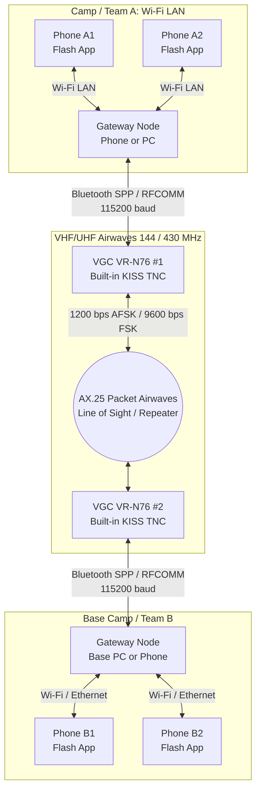
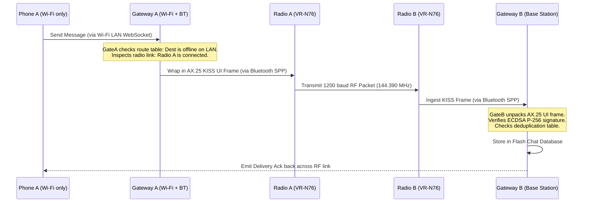

# Bluetooth Peer Transport & Hardware Radio KISS TNC Bridge Plan

**Author:** Flash Team  
**Date:** 2026-10-07  
**Status:** PROPOSED & DESIGN ONLY (NO IMPLEMENTATION COMMENCED). **Fact-checked and corrected 2026-10-07; see section 0.**  
**Modules Affected:** `:core:network`, `:core:discovery`, `:core:ptt`, `:core:messaging`, `:core:security`, `:ui:chat`, `:app`, `:desktop`  
**Hardware Reference:** Vero Telecom VGC VR-N76 / BTECH UV-PRO / Radioddity GA-5WB Dual-Band Handheld Radio  
**Parent Blueprint:** [android-lan-wifi-direct-transfer-app-plan.md](file:///C:/Users/KaliOxygen/Downloads/Flash/Project%20Goal%20and%20Blueprint/android-lan-wifi-direct-transfer-app-plan.md)  
**Related Plans:** [ENTERPRISE-HYBRID-PLAN.md](file:///C:/Users/KaliOxygen/Downloads/Flash/docs/ENTERPRISE-HYBRID-PLAN.md) (shared envelope, trust root), [DISCOVERY-RESILIENCE-PLAN.md](file:///C:/Users/KaliOxygen/Downloads/Flash/docs/network/DISCOVERY-RESILIENCE-PLAN.md), [LINUX-PORT-PLAN.md](file:///C:/Users/KaliOxygen/Downloads/Flash/docs/LINUX-PORT-PLAN.md), [PRESENCE-CONNECTIONS-PLAN.md](file:///C:/Users/KaliOxygen/Downloads/Flash/docs/network/PRESENCE-CONNECTIONS-PLAN.md)

---

## Implementation status 2026-10-09

The BT-0 / BT-1 groundwork was built and unit-tested on 2026-10-09 (one session, no radio available). **The plan's own status line
above ("DESIGN ONLY") is superseded for the pieces listed here; nothing below has touched a real radio or phone.** Details,
decisions and the hardware checklist: `docs/reports/2026-10-09-bluetooth-radio.md`. Exact byte layout: `docs/network/RADIO-WIRE-FORMAT.md`.

Built (package `com.transfer.flash.core.network.kiss` / `.radio` / `.radio.diag`, module `:core:network`):

- KISS streaming codec, AX.25 v2.2 UI codec (PID `F0`; `CC`/`CD` refused), Flash radio frame Profile M (AES-256-GCM, counter nonce,
  64-wide replay window, rotating tag and station label, segmentation to 16 segments, signed clear-text mode for Profile A).
- `ByteLink` seam; `KissTncDriver` (connect, TXDELAY/P/SlotTime/TXtail only if configured, pacing with injectable clock, reconnect with
  backoff, PROBE lines); in-memory links, a fake TNC and a fake air channel for tests.
- Platform links: desktop serial on jSerialComm 2.11.4 (`JvmSerialPortCatalog`), Android RFCOMM (`AndroidBluetoothCatalog`, SPP UUID and a
  Flash UUID; Android 12+ `BLUETOOTH_CONNECT`/`BLUETOOTH_SCAN` handling). Manifest entries added to `app`.
- Hardware-spike tool for BT-00: `./gradlew :desktop:radioLinkTest` (window) and `:desktop:radioLinkTestCli` (headless); spec `docs/ui/radio-link-test.md`.
- `StreamFramer` for a future Flash-to-Flash Bluetooth session; ADR-101 records the session-layer recommendation.

Not built: the adapter from the real pairing key to `RadioSession`, `FlashTransportType.BLUETOOTH` and the planner hook (see report:
touching shared enums/engine files was avoided), any chat/UI integration, compression, Profile A operation, fragmentation
retransmission, gateway/relay logic, anything about 9600 baud. Open facts stay open until BT-00 .. BT-08 are run.

---

## 0. Review corrections (2026-10-07, fact-checked against the code, docs and public sources)

The first draft of this plan was reviewed the day it was written. Corrections are applied inline (marked *[corrected]*)
and summarised here. **Status stays PROPOSED / DESIGN ONLY.** Nothing here is built, and every hardware statement below
that is not marked *verified* is a test to run, not a fact.

### 0.1 Errors in the draft that are now fixed

| # | First-draft claim | Finding | Source / how verified |
|---|---|---|---|
| E1 | Identity signing is **Ed25519** | Flash identity is **ECDSA P-256** (`SHA256withECDSA`), `FlashCrypto.kt:73-74`, `FlashCertMaker`, `GroupCrypto.kt`. Android minSdk is 24, so Ed25519 would also be a new library. A Java ECDSA signature is DER (about 70-72 B); the radio frame needs the raw `r||s` form (64 B). Wherever this document still says "Ed25519", read **ECDSA P-256**. | code read |
| E2 | `fp8` is an "8-byte fingerprint prefix" | `fp8` is **8 hex characters = 4 bytes** (`TxtCodec.kt:19`, `KEY_FP8`). A 4-byte prefix is also the collision budget you actually have. | code read |
| E3 | AX.25 `PID 0xCC` = "Flash custom protocol" | **`0xCC` is ARPA Internet Protocol** and `0xCD` is ARP. A TNC or digipeater may treat `0xCC` payloads as IP. Use `0xF0` (no layer 3). | verified: [AX.25 PID table (Wireshark)](https://wireshark.org/docs/wsar_html/ax25__pids_8h.html) |
| E4 | "Hybrid" APRS-text + signature + metadata frame is rendered on the radio LCD | **Cannot work as drawn.** APRS message text is at most **67 characters**, the addressee is padded to 9, and `{` ends the text and starts the message number. A base64 signature alone is 86-88 characters. See the replaced section 4.5. | verified: [APRS message format](https://aprs438.readthedocs.io/en/latest/addressed_message.html) |
| E5 | BLE advertisement = 128-bit UUID + 12 B manufacturer data | Legacy advertising is **31 bytes per packet** and Android fails larger data. 3 (flags) + 18 (128-bit UUID) + 16 (manufacturer data incl. company id) = **37**. Split across advertisement and scan response, or use a 16-bit/short UUID. | verified: [Nordic DevZone](https://devzone.nordicsemi.com/f/nordic-q-a/91624/advertising-128-bit-uuid-for-custom-service/384688) |
| E6 | Manufacturer-data bytes 0-1 are a "Flash magic" | The first two bytes of BLE manufacturer data are the **Bluetooth SIG company identifier**. Using `F1 A5` claims company id `0xA5F1`. Use a registered or test id deliberately and put the magic after it. | BLE spec |
| E7 | Static `fp8` in the advertisement | **Trackable** by anyone scanning. `docs/FUTURE-OPTIMIZATION.md` FO-02 and audit S9 ask for a *rotating* id. | docs read |
| E8 | "Existing Flash frame format `[Len 4B BE][Opcode 1B][Payload]`" | **No such format found.** The mesh uses WebSocket text frames (`FlashTextFraming`, `FLASH_*`) and binary chunk frames (`FLSH`/`FSEC`, 22-byte `FSEC` header, little-endian length). An RFCOMM stream also lacks the TLS + TOFU session layer the mesh relies on. A real session design is needed (section 3.2 note). | code + `docs/security.md` |
| E9 | "implementing `PeerTransport`" | **`PeerTransport` does not exist**; it is only a sketch in AGENTS.md section 16. The real seams are `FlashTransportType` (`LAN, WIFI_DIRECT, WEBSOCKET, RELAY, MESH, UNKNOWN`), `CompositeDiscovery.PRIORITY_ORDER` (reserves `BLE`), and `AutoConnector`/`ConnectionPlanner`. | code read |
| E10 | `FlashNearbyScreen` at `ui/chat/.../FlashNearbyScreen.kt` | Real path: `ui/chat/src/commonMain/.../ui/nearby/FlashNearbyScreen.kt`. | glob |
| E11 | Codec2 "1200 mode" and "700B mode" voice over 1200-baud AX.25 | **Not feasible in real time.** 1200 bps of voice is the entire raw channel before AX.25 headers (about 16-18 B each), the 300 ms TXDELAY per transmission, and CSMA. Even 700 bps is marginal on simplex. Voice over the TNC is only plausible at 9600 baud, and 9600 support is **unverified** (below). See the note in section 5.2. | arithmetic |
| E12 | RFCOMM "1.0-2.1 Mbps", range "10-100 m" | 2.1 Mbps is the EDR *raw* rate; real SPP throughput is lower and phones are Class 2 (about 10 m typical). Use these as hypotheses to measure. | BT spec; measure |
| E13 | "VGC VR-N76 ... 7W" | Retail sources disagree (5 W vs 7 W). Not verified. | [passion-radio](https://www.passion-radio.com/vhf-uhf/vgc-n76-3028.html), [hamradio.my](https://hamradio.my/vr-n76-7w-radio-experience-next-level-communication/) |
| E14 | Plan fits the project as-is | **Conflicts with ADR-056**: BLE discovery (DR6/FO-02) and Wi-Fi Direct (DR7/FO-03) are *postponed by the owner*. This plan is a new, larger scope and needs an owner decision before any code (AGENTS.md section 16: "do not build until needed"). | docs read |
| E16 | Plan names `OutboxScheduler` (`core/messaging`) and `FlashPttPlayout` (`core/ptt`) | **Neither symbol exists.** The durable outbox lives in `RealFlashChatRepository` (no `OutboxScheduler` in `core/messaging`); the PTT playout classes are `PttPlayoutCore` (common) and `JvmPttPlayout` (jvm). | grep |
| E15 | Desktop actual = "BlueZ / JNA" | Windows is the shipped desktop. A paired SPP radio appears there as a **virtual COM port** (serial library), which is simpler than BlueZ. Linux needs BlueZ via D-Bus, the same D-Bus decision as `docs/LINUX-PORT-PLAN.md` (D-L2). | [G7JJF KISS radios](https://www.g7jjf.com/kissradio.htm) |

### 0.2 Hardware facts: verified vs still a test

**Verified (public sources):** the BTECH UV-Pro and the VR-N76 have a built-in KISS TNC reached over Bluetooth, enabled in
*Menu > General Settings > KISS TNC*, and work with apps such as APRSDroid ([BTECH](https://baofengtech.com/?p=267522),
[VR-N76 + APRSDroid](https://hamradio.my/setting-up-bluetooth-kiss-tnc-on-verotelecom-vgc-vr-n76-with-aprsdroid/)).
The **Radioddity GA-5WB** also has a built-in Bluetooth KISS TNC ([Radioddity](https://radioddity.com/products/radioddity-ga-5wb)),
which the first review wrongly doubted.

**Unverified, must be tested on a real radio before design continues (new test `BT-00`):**
1. Bluetooth Classic SPP, BLE, or both for the data path, and what the "virtual COM port at 115200" claim means in practice.
2. **9600 baud** operation (the draft states it as fact; no source found).
3. **Whether the radio LCD shows incoming APRS messages while KISS is enabled.** Sources conflict: BTECH says leave
   "Digital Mode" *unchecked*, G7JJF says it must be *enabled*. This decides whether the "dual-mode" idea can exist at all.
4. That only one app may hold the radio link at a time (G7JJF: disconnect the phone app first).
5. Real 1200-baud throughput and latency with Flash-sized frames.

### 0.3 Deployment profile changes the security section (owner, 2026-10-07)

The owner states this software is for the **Ghana military**. The US amateur rules the draft built around (FCC Part 97:
no business traffic, no obscuring encryption, mandatory callsign) apply to **amateur-band use in the US**, not to a
government deployment in Ghana. Ghana's NCA licenses amateur radio separately and publishes a national frequency table;
**military assignments are decided by the owner's command, not by this software** and were not found publicly. Section 6 is
rewritten into two profiles. The bar goes **up** for the military profile: encryption on by default, no plaintext
positions or identities on the air, replay protection, fast revocation of a lost device.

### 0.4 Relationship to the other plans

See `docs/ENTERPRISE-HYBRID-PLAN.md` (the merged enterprise plan). The radio gateway, the hotspot relay (FO-06) and the
server relay should share one signed message envelope and one transport-capability model; this plan's `MeshRelayEngine`
should not be built as a private mechanism.

---

## 1. Executive Summary & Vision

Flash was designed from its inception with a decoupled transport abstraction ([`AGENTS.md` §16](file:///C:/Users/KaliOxygen/Downloads/Flash/AGENTS.md#L450)): the core engines (chunked file transfer, outbox message queues, ECDSA P-256 signing *[corrected, E1]*, and PTT voice floor arbitration) do not know or care whether bytes arrive over LAN, Wi-Fi Direct, or alternative physical media.

This plan expands Flash's transport architecture to support:
1. **Direct Flash-to-Flash Bluetooth Transport (Pillar A):** Zero-infrastructure, ad-hoc peer-to-peer data links over Bluetooth Classic (RFCOMM / SPP) and Bluetooth Low Energy (BLE L2CAP CoC). Works when Wi-Fi is disabled, unavailable, or restricted.
2. **Hardware Radio KISS TNC Gateway (Pillar B):** Integration with handheld and mobile VHF/UHF transceivers equipped with internal Bluetooth KISS TNCs (specifically the **VGC VR-N76** / **BTECH UV-PRO**). 
3. **Hybrid Mesh Bridging:** Relaying messages, presence beacons, and Push-to-Talk (PTT) audio between the high-speed local IP mesh (Wi-Fi/Ethernet) and the ultra-long-range RF packet radio link.

### The 3-Tier Physical Connectivity Hierarchy

```
┌───────────────────────────────────────────────────────────────────────────────┐
│ TIER 1: Local High-Speed IP Mesh (Wi-Fi LAN / Hotspot / Ethernet)             │
│ Speed: 50 – 100+ MB/s  │  Range: 10 – 50 m  │  Latency: < 5 ms                │
│ Content: 4K video, multi-peer video calls, bulk file transfer, swarm sharing  │
├───────────────────────────────────────────────────────────────────────────────┤
│ TIER 2: Direct Peer-to-Peer Bluetooth (Classic RFCOMM / BLE L2CAP)            │
│ Speed: 1 – 2 Mbps       │  Range: 10 – 100 m │  Latency: 20 – 50 ms            │
│ Content: Text chat, Opus PTT voice, photos, documents, mutual device pairing │
├───────────────────────────────────────────────────────────────────────────────┤
│ TIER 3: Off-Grid VHF/UHF Radio Bridge (Bluetooth KISS TNC / VR-N76)           │
│ Speed: 1200 – 9600 bps  │  Range: 5 – 50+ km │  Latency: 500 – 2000 ms        │
│ Content: Emergency SOS, text messages, GPS beacons, APRS telemetry, Codec2 PTT│
└───────────────────────────────────────────────────────────────────────────────┘
```

---

## 2. System Architecture



---

## 3. Pillar 1: Direct Flash-to-Flash Bluetooth Transport

### 3.1. Discovery: Bluetooth Low Energy (BLE) Advertisements
To avoid battery-draining continuous Bluetooth Classic discovery, discovery is duty-cycled over BLE:
* **Service UUID:** `0000F1A5-0000-1000-8000-00805F9B34FB` (Dedicated Flash P2P UUID).
* **Manufacturer Data Payload** *[corrected, E5/E6/E2/E7]*: legacy advertising is 31 bytes per packet, the first two bytes of
  manufacturer data are the Bluetooth SIG company id, and `fp8` is 4 bytes. Put the 128-bit UUID in the scan response (or use a
  short UUID), and use a **rotating** identifier, not a static fingerprint (FO-02, audit S9). Proposed layout (to be validated):
  - Bytes 0–1: company identifier (registered, or a test id used deliberately).
  - Bytes 2–3: Flash magic `0xF1 0xA5`.
  - Byte 4: Wire Version.
  - Byte 5: Capability flags (`CAP_CHAT | CAP_VOICE | CAP_TRANSFERS`).
  - Bytes 6–9: rotating 4-byte tag derived from the identity fingerprint and a time epoch (a paired peer can recompute it; a stranger cannot link it across epochs). *Not the static `fp8`.*
* **Scan Modes:**
  - `ECO`: Duty-cycled 5 seconds scan / 25 seconds idle.
  - `STANDARD`: Balanced 10 seconds scan / 10 seconds idle.
  - `BOOST`: Low-latency continuous scan for 30 seconds upon opening Nearby screen.

### 3.2. Data Link: Bluetooth Classic RFCOMM (SPP)
Once mutual discovery confirms a peer:
* The devices initiate an RFCOMM channel connection using Flash's standard SPP UUID:
  `F1A50001-B5A3-F393-E0A9-E50E24DCCA9E`
* **Transport Framing** *[corrected, E8]*: the draft's `[Length 4B BE][Opcode 1B][Payload]` is **not an existing Flash format**.
  The mesh is WebSocket-over-TLS with TOFU pinning. An RFCOMM byte stream has neither. Options to evaluate (needs its own ADR):
  (a) run the same TLS 1.3 session and a minimal length-prefixed framer over the RFCOMM stream and reuse `FlashTextFraming`
  payloads; (b) a new, documented `docs/protocol.md` section for a Bluetooth session with the pairing-derived `FSEC` AEAD.
  Either way the session must authenticate the peer with the pinned identity; Bluetooth pairing alone is not Flash trust.
* **Bandwidth & MTU:**
  RFCOMM provides 1.0–2.1 Mbps effective throughput. This comfortably supports:
  - Real-time text messaging (< 1 KB frames).
  - PTT Voice streaming using Opus at 16–24 kbps.
  - File transfers with adaptive chunk sizes scaled down to 64 KB (from the 1 MB LAN chunk size).

---

## 4. Pillar 2: Hardware Radio KISS TNC Gateway (VGC VR-N76)

### 4.1. Hardware Profile: VGC VR-N76 / BTECH UV-PRO
The VGC VR-N76 is a 5-7 W *(sources disagree, E13)* VHF/UHF handheld transceiver with an embedded AX.25 KISS TNC modem exposed via Bluetooth *(verified)*. The UV-Pro and GA-5WB share the KISS menu *(verified)*.
* **Bluetooth Profile:** Serial Port Profile (SPP), virtual COM port at 115200 baud, 8-N-1.
* **Firmware KISS Activation:** Radio settings $\rightarrow$ General Settings $\rightarrow$ KISS TNC: `Enable`.
* **Modulation Modes:**
  - 1200 baud Bell 202 AFSK on VHF (144.390 MHz standard APRS frequency, or simplex channels).
  - 9600 baud G3RUH FSK on UHF (where configured) — **UNVERIFIED, test `BT-00` item 2; do not design around it until measured.**

### 4.2. KISS Framing Specification (RFC / Phil Karn KISS Protocol)
Flash communicates with the radio's virtual serial port using standard KISS framing:

| Byte Name | Hex Code | Purpose |
|---|---|---|
| `FEND` | `0xC0` | Frame End (marks packet boundaries) |
| `FESC` | `0xDB` | Frame Escape (escapes reserved bytes) |
| `TFEND` | `0xDC` | Transposed Frame End (used when escaping `0xC0`) |
| `TFESC` | `0xDD` | Transposed Frame Escape (used when escaping `0xDB`) |

#### KISS Command Byte (Byte 0 after `FEND`):
* `0x00`: Data Frame (Port 0) — contains the AX.25 UI packet.
* `0x01`: `TXDELAY` (Transmitter key-up delay in 10 ms units, default `0x1E` = 300 ms).
* `0x02`: `P` (Persistence parameter for CSMA channel access, default `0x40`).
* `0x03`: `SlotTime` (Slot interval in 10 ms units, default `0x0A` = 100 ms).
* `0x04`: `TXTAIL` (Hold-up time after transmission in 10 ms units, default `0x02`).
* `0xFF`: Return to Normal / Exit KISS mode.

### 4.3. AX.25 Unnumbered Information (UI) Frame Layout
Packets sent over RF must conform to AX.25 Level 2.2 Unnumbered Information (UI) framing to ensure legal amateur radio compliance and compatibility with APRS digipeaters:

```
┌─────────────────────────────────────────────────────────────────────────────┐
│ AX.25 Header (14–28 bytes)                                                  │
│ ├─ Destination Callsign + SSID (e.g., "FLASH ", SSID: 0, 7 bytes)           │
│ ├─ Source Callsign + SSID (e.g., "N0CALL", SSID: 1, 7 bytes)                │
│ ├─ Optional Digipeater Path (e.g., "WIDE1-1, WIDE2-1", 7–14 bytes)          │
│ ├─ Control Field: 0x03 (UI Frame)                                           │
│ └─ PID Field: 0xF0 (No Layer 3). NEVER 0xCC (= ARPA IP) [corrected, E3]     │
├─────────────────────────────────────────────────────────────────────────────┤
│ Flash Radio Payload (Max 220 bytes)                                         │
│ ├─ Magic: 0xF1 0xA5 (2 bytes)                                               │
│ ├─ Type: 0x01 (TEXT) | 0x02 (PTT) | 0x03 (BEACON) | 0x04 (ACK) (1 byte)     │
│ ├─ Message ID Hash: (4 bytes)                                               │
│ ├─ Sender Device Fingerprint: (8 bytes)                                     │
│ ├─ Hop Count / TTL: (1 byte, initialized to 3)                              │
│ ├─ Compressed Payload: (Up to 140 bytes)                                    │
│ └─ ECDSA P-256 raw r||s signature: 64 bytes [corrected, E1] (or a 16-byte   │
│    AEAD tag instead, for pairwise frames: see section 6.3)                   │
└─────────────────────────────────────────────────────────────────────────────┘
```

### 4.4. End-to-End Custom Data Relay Pipeline

The radio hardware acts as a transparent digital modem bridging two disparate Flash endpoints across long physical distances:

```
[ Phone A / PC ] 
       │ (1) Sends Flash frame over Bluetooth SPP (115200 baud)
       ▼
[ VR-N76 #1 (KISS TNC) ] 
       │ (2) Internal DSP modulates bytes into 1200 baud Bell 202 AFSK audio tones
       ▼
   (( AIRWAVES ))  VHF (e.g. 144.390 MHz) or UHF (5-7 W, line-of-sight / repeaters)
       │ (3) Propagates across kilometers of terrain
       ▼
[ VR-N76 #2 (KISS TNC) ] 
       │ (4) Internal DSP demodulates audio tones back into digital bytes
       ▼
[ Phone B / PC ] 
         (5) Ingests bytes over Bluetooth SPP, verifies the ECDSA P-256 signature,
             records into Flash chat database, triggers OS notification & audio chime!
```

#### Step-by-Step Processing:
1. **Device A Transmission:** Flash formats a message, signs it with the identity key (ECDSA P-256), encapsulates it into an AX.25 UI frame, and wraps it in KISS delimiters (`FEND 0xC0 ... FEND 0xC0`). This is written directly to the Bluetooth SPP virtual COM port.
2. **Radio #1 Modulator:** The VR-N76 firmware reads the KISS frame, activates the RF power amplifier (`TXDELAY` ~300 ms), modulates the byte sequence into 1200 baud Bell 202 AFSK audio frequencies (1200 Hz mark / 2200 Hz space), and transmits the packet over the airwaves.
3. **RF Propagation:** The VHF/UHF signal travels over line-of-sight terrain (or through amateur packet digipeaters like `WIDE1-1, WIDE2-1`).
4. **Radio #2 Demodulator:** The receiving VR-N76 discriminates the frequency tones, decodes the AX.25 frame in its DSP, strips the RF carrier, and wraps the packet back into a KISS data frame (`Command 0x00`).
5. **Device B Delivery:** Radio #2 outputs the KISS frame over its Bluetooth connection to Phone B. The Flash engine unescapes the KISS framing, extracts the AX.25 payload, verifies the digital signature against Alice's public key, and inserts the message into the active conversation thread.

---

### 4.5. On-Screen Display on the VR-N76 & Hybrid Frame Architecture

Can the text message also be read directly on the receiving VR-N76's LCD screen without looking at the connected phone? **Yes**, through an intentional dual-mode hybrid framing strategy.

#### 1. Protocol Display Modes:
* **Pure Raw KISS TNC Mode:** When the radio is configured strictly as an external modem, packets are passed exclusively between Bluetooth and RF. The radio's LCD does not render packet contents.
* **APRS Text Message Mode (`:DESTCALL  :Message`):** The VR-N76 firmware contains an APRS text decoder. When an inbound AX.25 packet conforms to standard APRS human-readable text syntax, **the radio's LCD screen decodes and renders the sender's callsign and message text directly on the screen**.
* **Benshi Protocol Mode (Vero/BTECH Native):** The vendor command protocol over BLE/SPP that allows external apps to query and drive radio screen elements directly.

#### 2. The Flash Dual-Mode Hybrid Frame Format — **SUPERSEDED (invalid as drawn, E4)**

> **Why this design cannot work (kept for the record, AGENTS.md section 27):** APRS message text is limited to **67
> characters** and the addressee is padded to 9 ([source](https://aprs438.readthedocs.io/en/latest/addressed_message.html)).
> The `FLASH:<msgId>:<sig_b64>:...` metadata is *inside the text field*, so (1) it would be shown on the LCD as garbage and (2) a
> base64 signature (86-88 chars) alone exceeds the whole limit. `\x1F` has no meaning in APRS, and `{` introduces the message
> number, so the `{01` suffix is only valid at the very end of a text that contains no `{`. Whether the radio LCD shows APRS
> messages at all while KISS is enabled is itself **unverified** (see 0.2 item 3).
>
> **Replacement options (choose after `BT-00`):**
> * **Option A, no LCD readability (default).** Send Flash frames as AX.25 UI with `PID 0xF0` and a binary payload. The LCD
>   shows nothing; the phone is required. Simplest and the only one with room for authentication/encryption.
> * **Option B, LCD-readable text as a separate, unauthenticated courtesy frame.** A standard APRS message
>   (`:ADDRESSEE:text{n`, at most 67 chars) sent *in addition to* the Flash frame. It is plaintext, unauthenticated and
>   spoofable, so it is **never acceptable in the military profile (section 6)**, and it doubles airtime.
>
> The table in item 3 below also states radio-LCD behaviour (no chime, single-message memory, multi-tap keypad) that I could not
> verify. Treat it as a hypothesis.

*Original (invalid) design, kept for history:*
To give both a **standalone field operator** (holding only the radio) and a **connected smartphone user** (running Flash) full functionality, Flash structures the payload with a human-readable APRS prefix followed by digital metadata:

```
┌─────────────────────────────────────────────────────────────────────────────┐
│ AX.25 Address Header                                                        │
│ Dest: "FLASH   " | Source: "N0CALL-1" | Digis: "WIDE1-1"                    │
├─────────────────────────────────────────────────────────────────────────────┤
│ APRS Text Message Prefix (Rendered on VR-N76 LCD Screen)                    │
│ Format: :ALL      :Alice: Base camp set up. All safe.\x1F                   │
│         (The VR-N76 firmware parses this and prints it on its color LCD)    │
├─────────────────────────────────────────────────────────────────────────────┤
│ Flash Digital Metadata (Parsed by receiving Phone / PC)                     │
│ Format: FLASH:<msgId_hex>:<ed25519_sig_b64>:<ttl>:<ptt_flag>               │
│         (Flash on the phone strips this, verifies authenticity, and stores) │
├─────────────────────────────────────────────────────────────────────────────┤
│ Sequence / Ack Suffix                                                       │
│ Format: {01                                                                 │
└─────────────────────────────────────────────────────────────────────────────┘
```

#### 3. Why Phone + Radio Synergy Is Essential (Hardware Realities):
While the VR-N76 screen can display incoming messages, the radio hardware has three distinct usability limitations that Flash's phone/desktop app completely resolves:

| Capability | VR-N76 Radio Screen Alone | VR-N76 + Connected Flash App |
|---|---|---|
| **Incoming Alert** | Silent status line update; **no audio chime or popup** | **High-priority OS notification banner, custom chime & haptic vibration** |
| **Message History** | **Single-message memory:** newer incoming packets overwrite the display | **Full persistent SQLite chat conversation history** with timestamps |
| **Typing & Replies** | Tedious multi-tap on the 16-key rubber keypad | **Full virtual/physical QWERTY keyboard with autocomplete** |
| **Delivery Receipts** | None (best-effort fire-and-forget) | **Cryptographic Delivery ACKs** and delivery status checkmarks (✓✓) |
| **Identity & Trust** | Plaintext callsign string (spoofable on RF) | **ECDSA P-256 identity verification & contact trust badges** |

---

## 5. Pillar 3: Text & Push-to-Talk (PTT) Bridging

### 5.1. Text Messaging over Radio Bridge
Because AX.25 packet radio at 1200 baud provides approximately **120–150 bytes per second**, Flash implements an aggressive size-constrained encoding:
1. **Payload Compression:** *[corrected]* the draft's "160 characters compress to 30-50 bytes" with Deflate is **not credible** (zlib has about 8 bytes of header/trailer and gains little on a 160-character message; expect roughly 100-140 bytes). Use raw deflate with a preset dictionary, or a short-text scheme, and **measure** the ratio on real Flash messages before budgeting. Also note "120-150 B/s" is the raw channel rate; the usable rate after AX.25 headers, TXDELAY and CSMA is lower (to be measured, `BT-00` item 5).
2. **Segmentation & Reassembly (SAR):** Messages exceeding 180 bytes are split into numbered sub-frames (`part/total`).
3. **Delivery Acknowledgment (ACK):** The receiving radio transmits a compact 16-byte ACK frame back over the air.
4. **Outbox Pacing:** Flash's [`OutboxScheduler`](file:///C:/Users/KaliOxygen/Downloads/Flash/core/messaging) enforces a minimum transmission backoff (CSMA wait + random jitter 500–2000 ms) to avoid packet collisions on simplex RF channels.

### 5.2. PTT (Push-to-Talk) Over the Radio Bridge
Flash supports two distinct PTT modes across the radio link:

#### Mode 1: Digital Voice Packets (Codec2 Vocoder)
> **Feasibility warning [corrected, E11]:** the vocoder rates below equal 100% (1200) and about 58% (700) of a 1200-baud
> channel *before* AX.25 overhead (about 16-18 B per packet), a 300 ms TXDELAY per transmission and CSMA. Real-time
> voice is **not feasible at 1200 baud**. It becomes plausible only at 9600 baud, which is unverified. Treat Mode 1 as
> *conditional on `BT-00` item 2* and prefer Mode 2 or store-and-forward voice clips until measured.

For low-bandwidth digital voice through the KISS TNC data channel:
* Speech from the microphone is sampled at 8 kHz / 16-bit PCM.
* Compressed using **Codec2** (open-source speech vocoder for HF/VHF radio):
  - **Codec2 700B Mode:** Generates **88 bytes per second** (14 bytes per 160 ms audio frame).
  - **Codec2 1200 Mode:** Generates **150 bytes per second** (24 bytes per 160 ms audio frame).
* Packets are streamed as AX.25 UI frames through the KISS TNC.
* The receiving Flash station decodes Codec2 and routes the audio into [`FlashPttPlayout`](file:///C:/Users/KaliOxygen/Downloads/Flash/core/ptt).

#### Mode 2: Analog RF PTT (Hardware Bluetooth PTT Trigger)
For operating on standard analog FM voice channels (where other team members use traditional walkie-talkies):
* *(UNVERIFIED: no source found for HFP/SCO audio streaming to the transmitter or for `TX_START`/`TX_STOP` commands over SPP. These look like vendor ("Benshi") protocol features. Test on a real radio, or obtain the vendor protocol documentation, before relying on this.)* The VGC VR-N76 is claimed to expose a Bluetooth Audio (HFP/SCO) profile alongside its SPP data channel, plus Bluetooth PTT triggers.
* When the user presses the PTT button in Flash:
  1. Flash dispatches the Bluetooth PTT command (`TX_START`) to the radio.
  2. Flash streams 16 kHz audio over Bluetooth SCO directly to the radio transmitter.
  3. The radio keys the RF transmitter and broadcasts FM voice.
  4. Releasing PTT in Flash dispatches `TX_STOP`.

### 5.3. Hybrid Wi-Fi $\leftrightarrow$ Radio Mesh Relay Engine

A Flash device connected to a radio over Bluetooth can function as a **Relay Gateway**:



#### Loop Prevention & Deduplication Rules:
1. **Deduplication Table:** Gateways maintain a sliding memory window of recently seen `(originFingerprint, messageId)` hashes (1-hour expiry). Duplicate frames received over RF or Wi-Fi are dropped silently.
2. **Hop Count (TTL):** Every frame carries a 1-byte TTL (default 3). Each relay decrement the TTL by 1. If `TTL == 0`, the packet is dropped.
3. **No Retransmit on Inbound Interface:** A frame received from RF is never retransmitted back onto RF.

---

## 6. Legal, Security & Regulatory Compliance *(rewritten 2026-10-07 into two deployment profiles)*

**Authorization is the operator's responsibility, not the software's.** Flash never decides which frequency may be used.
Two profiles are supported by one codebase, selected by an explicit administrator setting, default = **Profile M**.

### 6.0. Profile M — Government / military deployment (the owner's stated target: Ghana)

Frequencies, power, equipment approval and operator authorization come from the deploying organisation's own spectrum
authority; this plan makes **no legal claim** for that profile (public searches found only civilian NCA amateur licensing and the
national frequency table, not military assignments). The engineering requirements are:

1. **Encrypted and authenticated by default.** Every radio frame is AEAD-protected with the existing pairing-derived pairwise
   key (`SecureBinaryFrameCodec` / HKDF, `docs/security.md` sections 4 and 6). For a pairwise frame the 16-byte GCM tag
   already authenticates the sender, so the 64-byte ECDSA signature can be dropped (saves 48 bytes of a 220-byte frame). For
   group/broadcast frames there is no pairwise key (no per-sender keys exist, AGENTS.md section 29), so a signature is still
   needed. Budget: 12-byte nonce + 16-byte tag (28 B), so about 190 of 220 B remain for header + payload. Use a counter-based
   nonce (not random) to save bytes and avoid the random-nonce bound.
2. **No plaintext identity or position on the air.** No callsign in the AX.25 address (use a neutral, rotating station label),
   **no periodic APRS/GPS beacons**, and no `WIDE1-1`-style digipeater paths into public networks. A cheap SDR plus direction
   finding turns every beacon into a location feed. If a position report is operationally required it is encrypted and
   rate-limited.
3. **Replay protection.** Each frame carries a monotonic counter bound to the pair key; a captured frame retransmitted later is
   rejected. (The draft's 1-hour dedup table does not stop replay beyond the hour.)
4. **Revocation.** A lost or captured radio/phone must be removable quickly. This is why the enterprise plan's admin-signed
   enrolment and revocation (`docs/ENTERPRISE-HYBRID-PLAN.md`, stage E2) is a prerequisite, not an extra.
5. **Key custody.** The desktop identity key is DPAPI-protected software, weaker than Android's non-exportable key (ADR-035).
   State this tier in deployment documents.
6. **Interception assumption.** 1200-baud AFSK is trivially demodulated by anyone nearby; confidentiality rests only on the
   encryption above. Traffic analysis (who talks, when, how much) is not hidden; document this residual risk.
7. **Hardware.** Consumer handhelds (VR-N76, UV-Pro, GA-5WB) on government spectrum are an equipment-approval question for the
   owner's command. Radios with internal KISS TNCs also hold their own settings and can be re-programmed by anyone holding them:
   treat the radio as an untrusted modem.

### 6.1. Profile A — Civilian amateur-band use (only if the software is ever sold to licensed amateurs, e.g. under the US FCC rules)
* **Rule (US, verified):** 47 CFR 97.113(a)(4) prohibits "messages encoded for the purpose of obscuring their meaning", and
  97.113(a) bars communications "on behalf of an employer" or for pecuniary interest ([Cornell LII](https://www.law.cornell.edu/cfr/text/47/97.113)).
  Other countries differ; this section is **not** a Ghana statement.
* **Flash Architecture Handling:** Flash implements a **Dual-Security Profile**:

| Channel / Mode | Encryption (Confidentiality) | ECDSA P-256 Signatures (Integrity & Identity) | Callsign Identification |
|---|---|---|---|
| **Direct Flash Bluetooth (Pillar A)** | **Enabled** (AES-256-GCM, existing `FSEC`) | **Enabled** | None (Device ID only) |
| **Profile M radio link** | **Enabled** (section 6.0) | Per 6.0 item 1 | **None on the air** |
| **Profile A amateur mode** | **DISABLED** (plaintext payload) | **ENABLED** | **Mandatory callsign** |

*(The draft's "Commercial / ISM" row is removed: transmitting on non-amateur spectrum with an amateur handheld is an
equipment-approval and licensing matter that this plan cannot assert, in any country.)*

> [!NOTE]
> **Digital signatures on amateur bands (US view, not verified in this review):** the common reading is that signatures and
> hashes are allowed when the payload stays readable, but 97.113(a)(4) is the controlling text; confirm with the regulator of
> the target country before shipping Profile A. Also unresolved for Profile A: third-party traffic and unattended (automatic
> control) gateway rules.

### 6.2. Mandatory Station Identification (Profile A only)
When operating in Amateur Radio Mode (Profile A):
* The user must input their FCC / national amateur radio **Callsign** in Flash settings.
* Flash automatically appends the callsign to all outgoing AX.25 packet headers.
* Flash periodically transmits an APRS station identification beacon every 10 minutes while the radio gateway is active.

---

## 7. Module-by-Module Codebase Integration Map

```
Flash Repository
├── core/
│   ├── network/
│   │   ├── src/commonMain/kotlin/com/transfer/flash/core/network/
│   │   │   ├── bluetooth/               <-- NEW: Bluetooth transport abstractions
│   │   │   │   ├── BluetoothStreamChannel.kt
│   │   │   │   └── BluetoothPeerTransport.kt
│   │   │   ├── kiss/                    <-- NEW: Sans-IO KISS & AX.25 codecs
│   │   │   │   ├── KissFrameCodec.kt
│   │   │   │   ├── Ax25FrameCodec.kt
│   │   │   │   └── RadioPayloadCodec.kt
│   │   │   └── relay/                   <-- NEW: Hybrid mesh routing & deduplication
│   │   │       ├── MeshRelayEngine.kt
│   │   │       └── DeduplicationStore.kt
│   │   ├── src/androidMain/kotlin/...   <-- Android BluetoothSocket implementation
│   │   └── src/jvmMain/kotlin/...       <-- Desktop BlueZ / JNA serial implementation
│   ├── discovery/
│   │   └── src/commonMain/...           <-- BLE discovery advertiser & scanner integration
│   ├── ptt/
│   │   ├── src/commonMain/...           <-- Codec2 vocoder framing (700/1200 bps)
│   │   └── src/jvmMain/...              <-- Bluetooth SCO / PTT button trigger wiring
│   └── messaging/
│       └── src/commonMain/...           <-- Radio outbox queue pacing & packet reassembly
└── ui/
    └── chat/
        └── src/commonMain/...           <-- "Radio Accessories" settings & APRS radar view
```

---

## 8. Phased Execution Roadmap

Execution is structured into 6 sequential phases **preceded by a hardware spike (BT-H)**. **No product code will be modified until authorized**, and BT-1.. need an owner decision because BLE and Wi-Fi Direct are postponed (ADR-056, FO-02, FO-03). Suggested registration: `docs/FUTURE-OPTIMIZATION.md` as FO-12 (radio) with the "bring back when" condition "owner confirms the radio link is a deliverable and `BT-00` passes".

### Phase BT-H: Hardware spike (test `BT-00`) — before everything else
* One real radio, one phone, one Windows PC. No Flash code is needed beyond a throwaway serial logger.
* Output: `logs/experiments.md` entry and updated UNVERIFIED markers in this plan (sections 0.2, 4.1, 4.5, 5.2).

### Phase BT-0: Pure Sans-IO Codecs & Frame Tests
* Implement pure Kotlin `KissFrameCodec` in [`core/network`](file:///C:/Users/KaliOxygen/Downloads/Flash/core/network) (escape handling, FEND boundaries).
* Implement `Ax25FrameCodec` (Callsign encoding, SSID, UI frame headers).
* Implement `RadioPayloadCodec` with Deflate compression and 220-byte MTU chunking.
* Capture golden test vectors for KISS and AX.25 frames; assert 100% test coverage in `commonTest`.

### Phase BT-1: Bluetooth Transport Engine (Direct Flash-to-Flash)
* Create the Bluetooth transport behind the real seams (`FlashTransportType` gains `BLUETOOTH`; `AutoConnector`/`ConnectionPlanner`; `CompositeDiscovery` already reserves `BLE`). `PeerTransport` does not exist yet (E9). Needs an ADR for the session-layer question in section 3.2.
* Android actual: `BluetoothSocket` over RFCOMM (`UUID: F1A50001-...`).
* Desktop actual: JNA / BlueZ RFCOMM sockets.
* Wire Bluetooth into [`AutoConnector`](file:///C:/Users/KaliOxygen/Downloads/Flash/core/network/src/commonMain/kotlin/com/transfer/flash/core/network/planner/AutoConnector.kt) as fallback when Wi-Fi is disconnected.
* Loopback test: transmit text chat and files across Bluetooth socket.

### Phase BT-2: BLE Beacon Discovery & Pairing UI
* Implement BLE advertiser emitting Flash compact manufacturer data.
* Implement BLE scanner with duty-cycled power management.
* Extend [`FlashNearbyScreen`](file:///C:/Users/KaliOxygen/Downloads/Flash/ui/chat/src/commonMain/kotlin/com/transfer/flash/ui/chat/FlashNearbyScreen.kt) to display Bluetooth devices with a distinctive Bluetooth icon.
* Wire 6-digit numeric comparison pairing over Bluetooth.

### Phase BT-3: KISS TNC Radio Bridge & VGC VR-N76 Driver
* Implement `BluetoothSerialPortBridge` connecting to paired Bluetooth TNC radios.
* Implement `VeroRadioDriver`:
  - Initialization handshake and KISS mode activation.
  - Setting TXDELAY, persistence, and slottime parameters.
  - Parsing incoming AX.25 frames from serial stream.
* Add "Radio TNC Accessories" settings screen (Callsign input, Ham Radio Mode toggle, Baud rate 115200).

### Phase BT-4: Hybrid Mesh Relay Engine
* Implement `MeshRelayEngine`:
  - Wi-Fi $\leftrightarrow$ Radio bi-directional message forwarding.
  - Deduplication cache based on SHA-256 message IDs.
  - TTL decrement and drop rules.
* Outbox queue prioritization: Emergency SOS $\rightarrow$ Text message $\rightarrow$ Delivery ACK $\rightarrow$ Location beacon.

### Phase BT-5: PTT & Voice Radio Bridge
* Add Codec2 audio encoder/decoder in [`core:ptt`](file:///C:/Users/KaliOxygen/Downloads/Flash/core/ptt) for 700/1200 bps digital voice.
* Implement Bluetooth SCO / HFP audio routing to radio hardware.
* Wire in-app PTT button to transmit hardware PTT commands over Bluetooth SPP.
* Verify cross-network voice: User on Wi-Fi speaks $\rightarrow$ Gateway transmits over RF $\rightarrow$ Remote radio plays voice.

---

## 9. Verification & Backlog Scenarios

| Test ID | Area | Scenario | Acceptance Criteria |
|---|---|---|---|
| `BT-01` | Codec | KISS Frame encode & decode with escaped `FEND` bytes | Byte-identical round-trip; handles truncated and malformed frames without throwing. |
| `BT-02` | Codec | AX.25 UI frame creation with callsigns and digipeater paths | Valid AX.25 frame structure asserted against standard Direwolf/APRS golden vectors. |
| `BT-03` | P2P | Direct phone-to-phone text chat over Bluetooth RFCOMM | Messages deliver in < 100 ms with Wi-Fi and Cellular radios completely turned off. |
| `BT-04` | TNC | Connect phone to VGC VR-N76 over Bluetooth SPP | Radio confirms KISS mode; TX LED illuminates on packet send; packet heard on monitor receiver. |
| `BT-05` | Mesh | Phone A (Wi-Fi) $\rightarrow$ Gateway (Wi-Fi + BT) $\rightarrow$ Radio $\rightarrow$ Remote PC | Text message sent on Wi-Fi reaches remote PC over RF airwaves; delivery ACK returns to Phone A. |
| `BT-06` | PTT | User presses PTT in Flash while paired with VR-N76 | Radio keys transmitter immediately; Codec2 audio or FM voice broadcast clear on receiving radio. |
| `BT-00` | **Hardware spike (FIRST)** | On a real VR-N76/UV-Pro/GA-5WB: (1) which Bluetooth type carries KISS; (2) does 9600 baud work; (3) does the LCD show APRS text while KISS is on; (4) one-app-at-a-time limit; (5) real 1200-baud goodput for a 220-byte Flash frame | Written results in `logs/experiments.md` (EXP-NNN) with firmware versions; the sections of this plan marked UNVERIFIED are updated from them. Nothing else in this plan starts before `BT-00`. |
| `BT-07` | Profile split | **Profile M:** capture the RF audio with a monitor receiver. **Profile A:** same with Amateur mode on | M: nothing decodable without keys, no callsign/position beacon, a replayed captured frame is rejected. A: payload is plaintext, signature intact, callsign present. |
| `BT-08` | Replacement of the invalid hybrid frame | Option A (binary frame) and, only for Profile A, Option B (APRS courtesy text <= 67 chars) | A: phone receives and verifies; LCD behaviour recorded as observed (not assumed). B: the radio LCD shows the 67-character text *if* `BT-00` item 3 allows it; Profile M never uses B. |

---

## 10. Conclusion & Architectural Readiness

This plan allows Flash to bridge the gap between high-speed consumer local networking and rugged off-grid radio telemetry without breaking or rewriting any of Flash's existing transfer engines or database repositories.

Everything remains in **design-only mode**. No product files have been modified.
